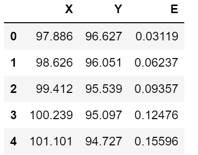

## Code Blocks
### Extract coordinators of 3D object from Gcode file and write them to a csv file

```python
import pandas as pd
import re
import csv
file_name = 'CE3PRO_cube_with_hole.gcode'

header = ['X', 'Y', 'E']
coordinates = []
with open(file_name, 'r') as f:
    content = f.readlines()
    for line in content:
        line = line.strip()
        coord = re.findall(r'[XYE].?\d+.\d+.\d+', line)
        try:
            if coord:
                coordinates.append([coord[0][1:], coord[1][1:], coord[2][1:]])
        except IndexError:
            pass

with open('coordinates_gcode.csv', 'w') as f:
    writer = csv.writer(f)
    # write the header
    writer.writerow(header)
    for row in coordinates:
        # write the data
        writer.writerow(row)
```



### Print the 3D design of the object
```python
import matplotlib.pyplot as plt
fig = plt.figure(figsize=(12, 12))
ax = fig.add_subplot(projection='3d')
plt.title("3D printing")
ax.scatter(df['X'], df['Y'], df['E'])
plt.show()
```
