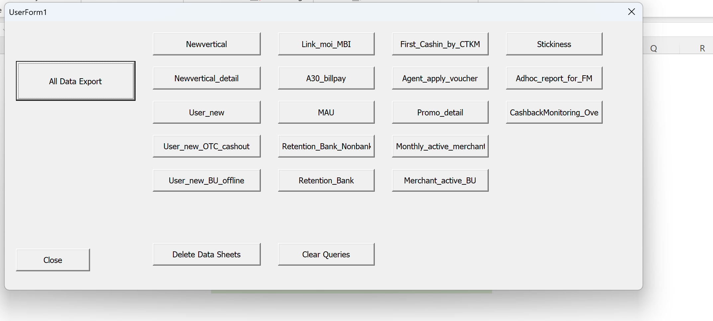
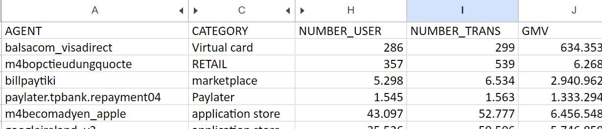

Create a pop-up userform to let users choose what data they want to extract

Then extract data using the following VBA code.

```VB
Public startdate As String
Public enddate As String

Sub data_newvertical()
'
'
Application.ScreenUpdating = False
Application.DisplayAlerts = False
startdate = ActiveWorkbook.Sheets("MASTER").Range("L16").Value
enddate = ActiveWorkbook.Sheets("MASTER").Range("L18").Value
'
    ActiveWorkbook.Queries.Add Name:="Query_newvertical", Formula:= _
        "let" & Chr(13) & "" & Chr(10) & "    Source = Odbc.Query(""dsn=Bigquery"", ""SELECT YEAR,MONTH,BU_NAME,NEWVERTICAL_Merchant,COUNT(DISTINCT USER_PAYMENT) AS NUMBER_USER, SUM(NUMBER_TRANSACTION) AS NUMBER_TRANSACTION, SUM(VALUE_TRANSACTION) AS VALUE_TRANSACTION FROM `momovn-prod.REPORT.MONTHLY_REPORT_L4_TRANS` WHERE TRANS_DATE BETWEEN '" & startdate & _
        "' AND '" & enddate & "' AND USER_TYPE != 'OTHERS' AND master_sim != 'Master Sim' GROUP BY 1,2,3,4"")" & Chr(13) & "" & Chr(10) & "in" & Chr(13) & "" & Chr(10) & "    Source" & _
        ""
    Sheets.Add After:=ActiveSheet
    With ActiveSheet.ListObjects.Add(SourceType:=0, Source:= _
        "OLEDB;Provider=Microsoft.Mashup.OleDb.1;Data Source=$Workbook$;Location=Query_newvertical;Extended Properties=""""" _
        , Destination:=Range("$A$1")).QueryTable
        .CommandType = xlCmdSql
        .CommandText = Array("SELECT * FROM [Query_newvertical]")
        .RowNumbers = False
        .FillAdjacentFormulas = False
        .PreserveFormatting = True
        .RefreshOnFileOpen = False
        .BackgroundQuery = True
        .RefreshStyle = xlInsertDeleteCells
        .SavePassword = False
        .SaveData = True
        .AdjustColumnWidth = True
        .RefreshPeriod = 0
        .PreserveColumnInfo = True
        .ListObject.DisplayName = "Query_newvertical"
        .Refresh BackgroundQuery:=False
    End With
    Selection.ListObject.QueryTable.Refresh BackgroundQuery:=False
    ActiveWorkbook.Queries("Query_newvertical").Delete
    ActiveSheet.Name = "1.New_Vertical"
    Columns("F:H").NumberFormat = "#,##0"
Application.ScreenUpdating = True
Application.DisplayAlerts = True
End Sub
```
