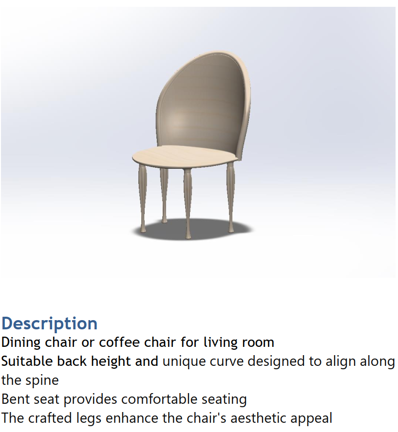
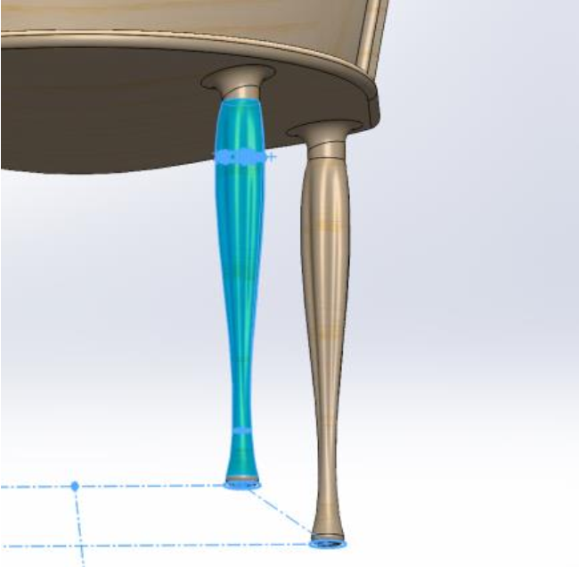
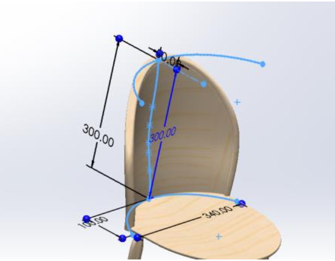

I designed a chair to serve as a functional and aesthetic dining chair or coffee chair using SolidWorks. 
Considering the yield strength, tensile strength, factor of safety, the chair with Aluminium Alloy 7050 as the main material has successfully gone through the test of stress, displacement, deformation.

